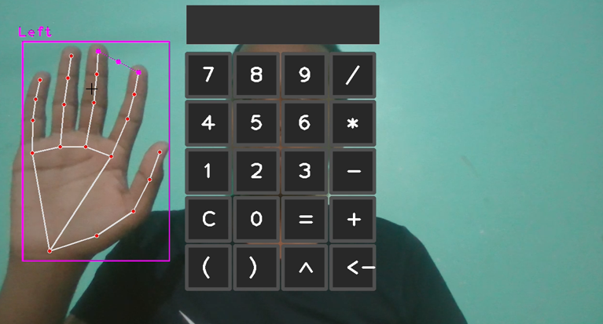
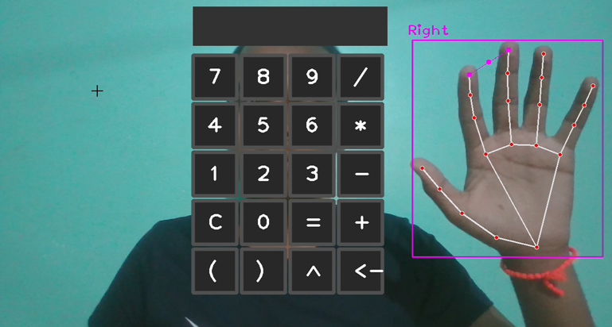
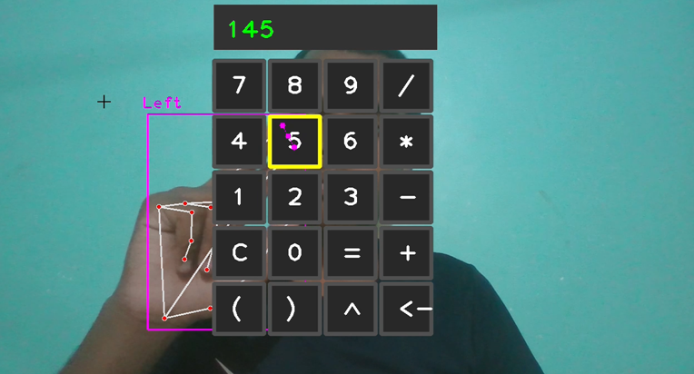
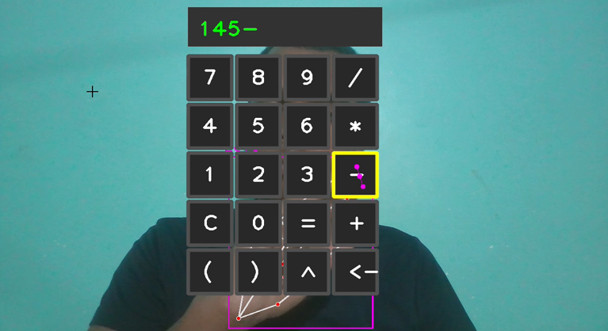
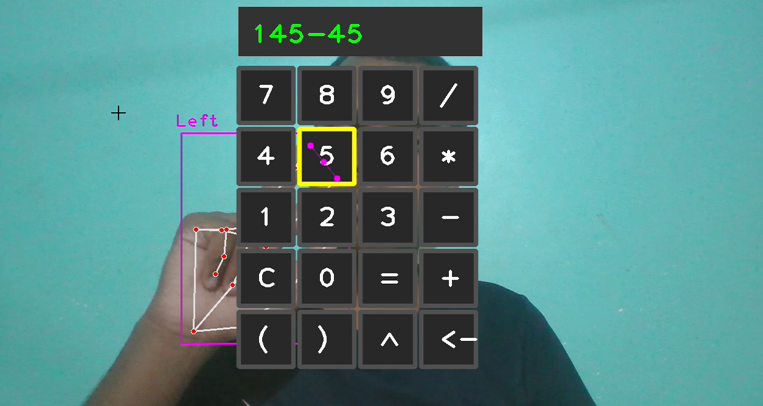
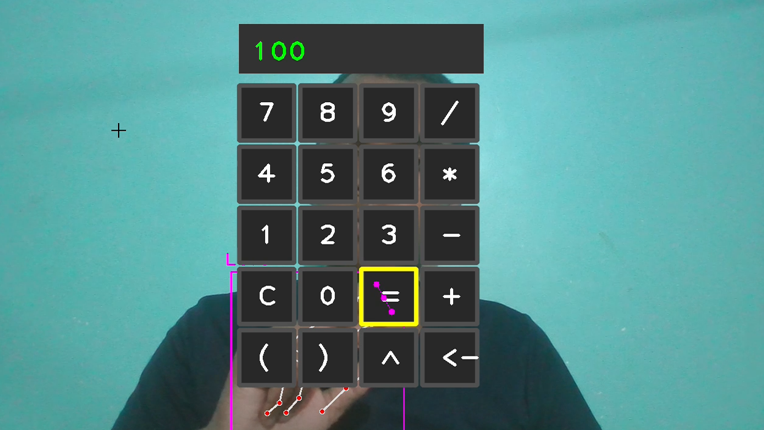

**🚀 HAND GESTURE BASED VIRTUAL CALCULATOR**
================================

**Project Title:** Virtual Calculator 👋
**Tagline:** "A hand-gesture controlled calculator for the modern era"

**📖 Description**
---------------

The Virtual Calculator is an innovative project that utilizes computer vision and machine learning to enable users to perform mathematical calculations using hand gestures. This project aims to revolutionize the way we interact with calculators, making it more intuitive and accessible for people of all ages and abilities. With the Virtual Calculator, users can perform complex calculations, such as algebra and geometry, using simple hand gestures, making it an ideal tool for students, professionals, and anyone who wants to streamline their calculation process.

The project utilizes OpenCV and HandTrackingModule to detect and track hand gestures, allowing users to perform calculations with ease. The calculator is designed to be user-friendly, with a simple and intuitive interface that allows users to switch between different modes, such as addition, subtraction, multiplication, and division.

**✨ Features**
-------------

1. **Hand Gesture Recognition**: The Virtual Calculator uses HandTrackingModule to recognize and track hand gestures, allowing users to perform calculations with ease.
2. **Mathematical Operations**: The calculator supports a range of mathematical operations, including addition, subtraction, multiplication, and division, making it suitable for a variety of applications.
3. **Intuitive Interface**: The calculator features a simple and intuitive interface that allows users to switch between different modes and perform calculations quickly and easily.
4. **Precise Calculations**: The calculator is capable of performing precise calculations, making it an ideal tool for students and professionals.
5. **Multi-Modal Support**: The calculator supports multiple modes, including algebra and geometry, making it suitable for a variety of applications.
6. **Hand Gesture Recognition**: The calculator recognizes and tracks hand gestures, allowing users to perform calculations with ease.
7. **Real-time Feedback**: The calculator provides real-time feedback, allowing users to see the results of their calculations in real-time.
8. **User-Friendly**: The calculator is designed to be user-friendly, making it accessible to users of all ages and abilities.

**🧰 Tech Stack Table**
--------------------

| Technology | Version |
| --- | --- |
| Python | 3.8 |
| OpenCV | 4.5.1 |
| HandTrackingModule | 1.0 |
| NumPy | 1.20.0 |

**⚙️ How to Run**
----------------

To run the Virtual Calculator, follow these steps:

1. Install the required dependencies by running `pip install -r requirements.txt`.
2. Run the Virtual Calculator using `python virtual_calculator.py`.
3. The calculator will start and be ready to use.

**📸 Screenshots**

**👤 Author**
Meghasham Nemade

The Virtual Calculator is developed by Meghasham Nemade, a passionate developer who believes in the power of innovation and technology to improve people's lives.

The Virtual Calculator is licensed under the MIT License. See the `LICENSE` file for more information.

I hope you enjoy using the Virtual Calculator!
